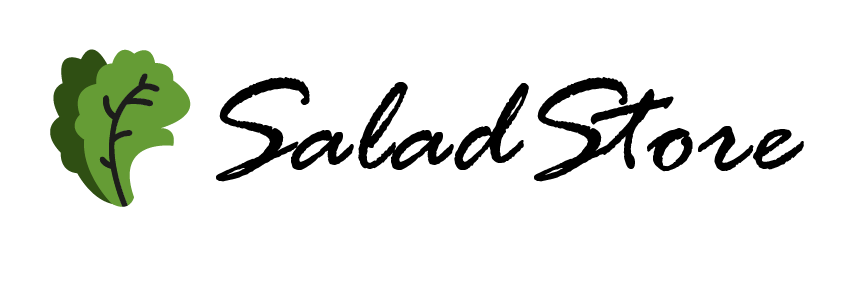

<!-- AUTO-GENERATED-CONTENT:START (STARTER) -->

  

<h1 align="center">
  SaladStore - Guide
</h1>

This project is a created with [Create React App](https://github.com/facebook/create-react-app).

This small project of a _Shippings guides_ it is a personal project to complement another page. I created this project of 0. I made its React.js structure and [MaterialUI](https://material-ui.com/) styles.  I decided on the design of the page based on the color combination of the personal proyect *"SaladTech"*.

## Available Scripts

In the project directory, you can run:

### `npm install`

Remember use *npm install* for download folder node_modules. 

### `npm start`

Runs the app in the development mode. 
Open [http://localhost:3000](http://localhost:3000) to view it in the browser.

The page will reload if you make edits. 
You will also see any lint errors in the console.

## 🚀 To view the website you can click on the link below

<a href="https://saladguide.web.app/">saladguide.web.app</a>

## 🧐 Thanks for reading me. See you!

